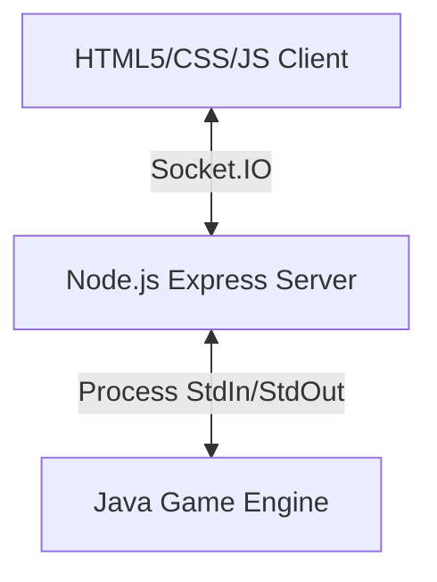

# Lost Cities Game & Web Wrapper

A high-fidelity web application wrapper for the classic card game **Lost Cities**, featuring a Java game engine with multiple AI strategies and a Node.js web interface.

Originally developed as part of the Summer Science Research Program under Dr. Sean McCulloch at Ohio Wesleyan University to research game-playing AI, this repository wraps the Java execution thread with a real-time web UI.

## 🚀 Features

- **Multiple AI Strategies**: Play against greedy, minimax, or alpha-beta agents. Search agents evaluate complete turns by simulating the outgoing card and incoming draw together.
- **Adaptive Search Evaluation**: Minimax and alpha-beta score known cards after each simulated move, choosing only expedition paths that improve the actual reachable hand state instead of relying on fixed opening thresholds.
- **Pass & Play Mode**: Play human-vs-human locally, complete with an interactive passing screen to hide cards between player turns.
- **Modern Web UI**: Responsive glassmorphic layout, cursor-glow spotlight borders, and clear inline controls for playing and drawing cards.
- **Engine Logs CLI**: Direct collapsible visibility into the running Java process stdout/stderr stream in real-time.
- **Clean State Management**: Prevents illegal plays and invalid discards directly via validation synchronizations with the JVM socket stream.
- **Regression Self-Check**: `AiSearchRegressionTest` verifies fixed-seed AI-vs-AI matches terminate without discard-draw loops.

## 🛠️ Architecture



1. **Frontend**: Static HTML5 client powered by vanilla JS and CSS custom variables, utilizing Socket.IO for real-time state communication.
2. **Backend**: Express wrapper running on Node.js which orchestrates, spawns, and communicates with the underlying Java engine.
3. **Engine**: Core game simulation, state verification, and decision-making AI running directly in the Java Virtual Machine.

## AI Engine

The Java engine supports three AI modes:

- **Greedy**: Chooses the best immediate outgoing play, then the best available draw.
- **Minimax**: Enumerates legal full-turn pairs, combining a place/discard decision with a deck or discard draw before evaluating the resulting hand.
- **Alpha-beta**: Adds an opponent-response estimate on top of the minimax turn search.

The search evaluator is intentionally state-driven: after a simulated draw, it scores every legal subset of the cards currently available in each color and keeps the best reachable expedition score. Empty expeditions can remain unstarted, so the agents avoid weak openings without tuned thresholds.

## 📦 Getting Started

### Prerequisites

- Node.js (v18+)
- Java SE Development Kit (JDK 8+)

### Running Locally

1. Clone this repository and navigate to the directory:
   ```bash
   cd LostCities
   ```
2. Install Node dependencies:
   ```bash
   npm install
   ```
3. Compile the Java files:
   ```bash
   javac LostCities/*.java
   ```
4. Run the AI regression check:
   ```bash
   cd LostCities
   java AiSearchRegressionTest
   cd ..
   ```
5. Start the server:
   ```bash
   npm start
   ```
6. Open your browser to `http://localhost:8082`.

## Deployment

The GCP host runs the Java engine from compiled `.class` files, so deploys must compile after pulling source changes:

```bash
ssh gcp-showcase "cd /opt/LostCities && git pull origin master && cd LostCities && javac *.java && java AiSearchRegressionTest && cd .. && pm2 restart lost-cities"
```
