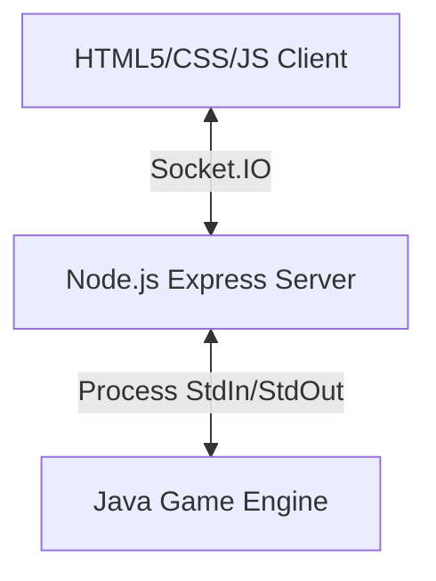

# Lost Cities Game & Web Wrapper

A high-fidelity web application wrapper for the classic card game **Lost Cities**, featuring a Java game engine powered by an AI opponent and a Node.js web interface.

Originally developed as part of the Summer Science Research Program under Dr. Sean McCulloch at Ohio Wesleyan University to research game-playing AI, this repository wraps the Java execution thread with a real-time web UI.

## 🚀 Features

- **Double-Agent Gameplay**: Competently play against a Java-based AI opponent (using Minimax/Alpha-Beta search).
- **Pass & Play Mode**: Play human-vs-human locally, complete with an interactive passing screen to hide cards between player turns.
- **Modern Web UI**: Responsive glassmorphic layout, cursor-glow spotlight borders, and clear inline controls for playing and drawing cards.
- **Engine Logs CLI**: Direct collapsible visibility into the running Java process stdout/stderr stream in real-time.
- **Clean State Management**: Prevents illegal plays and invalid discards directly via validation synchronizations with the JVM socket stream.

## 🛠️ Architecture



1. **Frontend**: Static HTML5 client powered by vanilla JS and CSS custom variables, utilizing Socket.IO for real-time state communication.
2. **Backend**: Express wrapper running on Node.js which orchestrates, spawns, and communicates with the underlying Java engine.
3. **Engine**: Core game simulation, state verification, and decision-making AI running directly in the Java Virtual Machine.

## 📦 Getting Started

### Prerequisites

- Node.js (v18+)
- Java SE Development Kit (JDK 8+)

### Running Locally

1. Clone this repository and navigate to the directory:
   ```bash
   cd LostCities
   ```
2. Install Node dependencies:
   ```bash
   npm install
   ```
3. Compile the Java files:
   ```bash
   javac LostCities/*.java
   ```
4. Start the server:
   ```bash
   npm start
   ```
5. Open your browser to `http://localhost:8082`.
